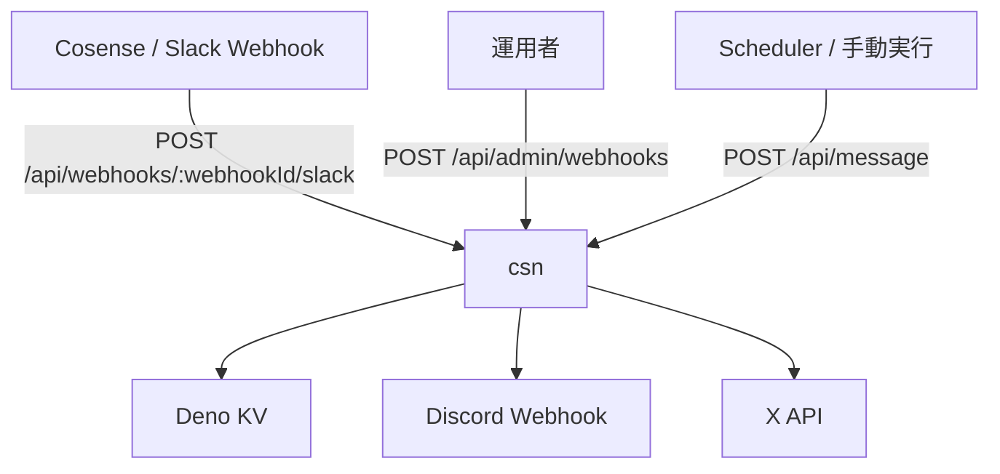

# csn

Cosenseを外部サービスに通知するアプリケーション

Scrapbox-Stream-Notifyの後継を想定。

## アーキテクチャ



### 処理の流れ

1. `POST /api/admin/webhooks` で `webhookId` を発行する
2. Cosense 側から `POST /api/webhooks/:webhookId/slack` に更新通知を送る
3. サーバーがページ情報を Deno KV に保存する
4. `POST /api/message` で指定時刻以降の更新を取得し、Discord または X に通知する

## 使い方

### 1. 起動

必要な環境変数を設定してから起動します。

- `ADMIN_API_KEY`: webhook 登録用の管理キー
- `DISCORD_WEBHOOK_URL`: Discord 通知先
- `API_KEY`
- `API_KEY_SECRET`
- `ACCESS_TOKEN`
- `ACCESS_TOKEN_SECRET`

```bash
deno task start
```

`X` 向けの認証情報や `DISCORD_WEBHOOK_URL` が未設定でも、送信はスキップされてログ出力だけ行われます。

### 2. webhookId を発行する

```bash
curl -X POST http://localhost:8000/api/admin/webhooks \
  -H 'Content-Type: application/json' \
  -d '{"apiKey":"YOUR_ADMIN_API_KEY"}'
```

レスポンス例:

```json
{
  "status": "registered",
  "webhookId": "xxxxxxxx-xxxx-xxxx-xxxx-xxxxxxxxxxxx"
}
```

### 3. Cosense の更新を受け取る

Cosense の通知を受け取るには、先に発行した `webhookId` を Cosense 側の設定に埋め込む必要があります。Cosense 側の Slack Webhook 通知先として、以下の URL を設定してください。

```text
POST /api/webhooks/:webhookId/slack
```

例:

```text
http://localhost:8000/api/webhooks/xxxxxxxx-xxxx-xxxx-xxxx-xxxxxxxxxxxx/slack
```

`webhookId` が一致しない通知は `Invalid webhook ID` として拒否されます。

受信したページ情報は `webhookId` ごとに Deno KV に保存され、1週間より古いデータは受信時に削除されます。

### 4. 通知を送る

指定した時刻以降の更新を Discord または X に送信します。

```bash
curl -X POST http://localhost:8000/api/message \
  -H 'Content-Type: application/json' \
  -d '{
    "webhookId":"xxxxxxxx-xxxx-xxxx-xxxx-xxxxxxxxxxxx",
    "notification":"Discord",
    "from_timestamp":"2026-04-18T00:00:00.000Z"
  }'
```

`notification` には `Discord` または `X` を指定します。

## 開発

```bash
deno task test
deno task test:watch
deno task test:coverage
deno fmt
deno lint
```
